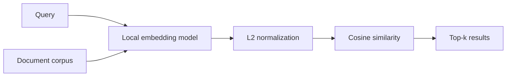

# K-BMEM

K-BMEM is a portfolio research prototype for Korean–English medical dense retrieval in on-premise environments. The project studies collision-safe contrastive fine-tuning, bilingual robustness, and reproducible embedding evaluation.

> Research prototype only. It is not a medical device, clinical decision-support system, or substitute for professional judgment.

## What is included

- A small, model-agnostic cosine retrieval example
- Synthetic text examples that contain no source-dataset records
- Aggregate benchmark results and explicit limitations
- Model and data cards describing what is **not** released

Model weights and source datasets are intentionally absent pending license review.

## System outline



## Aggregate evaluation snapshot

| Model | Exam accuracy@1 | AIHub nDCG@10 |
|---|---:|---:|
| K-BMEM | 0.2519 | 0.9061 |
| KURE | 0.2331 | 0.8246 |
| BGE-M3 | 0.2218 | 0.8195 |
| Qwen3-Embedding-0.6B | 0.2556 | 0.8847 |
| OpenAI text-embedding-3-small | 0.2744 | 0.5079 |
| OpenAI text-embedding-3-large | 0.2707 | 0.7780 |

Exam contains 266 Korean medical MCQs and measures option-ranking accuracy. AIHub strict passage contains 339 Korean question/passage pairs and measures nDCG@10. It is an auxiliary pair-matching task, not open-corpus RAG.

No K-BMEM-versus-reference Exam comparison was statistically significant after Holm correction. On AIHub, K-BMEM was higher than KURE, BGE-M3, and both OpenAI arms after Holm correction; the Qwen3 difference was not significant. Both splits had prior evaluation exposure, so these numbers are not presented as pristine final-test evidence.

## Try the generic retrieval example

```bash
python -m venv .venv
source .venv/bin/activate
pip install -r requirements.txt
python demo_search.py --model nlpai-lab/KURE-v1 --query "hypertension management"
```

The command may download the named third-party model. For an air-gapped environment, pass a local model directory instead. The released example does not contain K-BMEM weights.

## Repository status

This public repository distributes its source code under the MIT License. Model weights and source datasets are not included.

## Reproducibility and scope

- Python 3.11
- `sentence-transformers==5.7.0`
- Cosine similarity over normalized dense embeddings
- No patient data, source-dataset text, query identifiers, qrels, or embedding vectors are included

See [MODEL_CARD.md](MODEL_CARD.md), [DATA_CARD.md](DATA_CARD.md), and [NOTICE.md](NOTICE.md).
