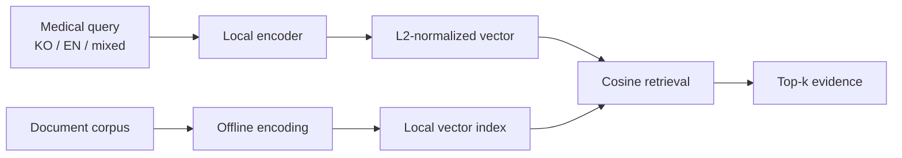

<p align="center">
  
</p>

<p align="center">
  <a href="https://github.com/RUMPELL/K-BMEM/actions/workflows/ci.yml"></a>
  <a href="LICENSE"></a>
  
  
</p>

<p align="center">
  A reproducible research prototype for <strong>Korean–English medical dense retrieval</strong><br>
  designed for privacy-sensitive, on-premise environments.
</p>

<p align="center"><a href="README.ko.md">한국어</a> · <a href="#results-at-a-glance">Results</a> · <a href="#quick-start">Quick start</a> · <a href="MODEL_CARD.md">Model card</a></p>

> **Scope:** K-BMEM is an engineering and evaluation project, not a medical device or clinical decision-support system. Model weights and source datasets are not distributed in this repository.

## Why this project?

Korean clinical and biomedical text frequently mixes Korean descriptions with English disease names, drug names, abbreviations, and laboratory terminology. General-purpose embeddings can miss these domain-specific distinctions, while external APIs may be unsuitable for sensitive hospital data.

K-BMEM explores a local-first alternative with three priorities:

1. **Medical semantic discrimination** — train on hard positive/negative relations rather than keyword overlap alone.
2. **Korean–English robustness** — evaluate Korean, English, and code-switched medical language explicitly.
3. **Evidence before promotion** — freeze protocols, report uncertainty, and reject training variants that do not improve held-out evidence.

## What I built

| Area | Engineering contribution |
|---|---|
| Data | Collision-safe contrastive batches with length balancing and false-negative controls |
| Training | Local dense-embedding fine-tuning with checkpoint identity and deterministic batch plans |
| Evaluation | Paired bootstrap confidence intervals, exact McNemar tests, sparse/dense/reference comparisons |
| Research | DAPT, reranker distillation, hybrid retrieval, code-switching, and source-ablation experiments |
| Deployment | Air-gapped design: local models, local indexes, and no required inference-time API |

## Architecture



The `src/kbmem` package exposes the retrieval core as a small model-agnostic Python package; any compatible SentenceTransformer model ID or local directory can be supplied at runtime. The batch-construction, fine-tuning, and evaluation pipelines that produced the results below are published verbatim under [`research/`](research/README.md) (4 scripts, 308 unit tests), with a claim-to-code map.

## Results at a glance

| Model | Medical Exam<br>accuracy@1 ↑ | AIHub paired passage<br>nDCG@10 ↑ |
|---|---:|---:|
| **K-BMEM** | 0.2519 | **0.9061** |
| KURE | 0.2331 | 0.8246 |
| BGE-M3 | 0.2218 | 0.8195 |
| Qwen3-Embedding-0.6B | 0.2556 | 0.8847 |
| OpenAI text-embedding-3-small | **0.2744** | 0.5079 |
| OpenAI text-embedding-3-large | 0.2707 | 0.7780 |

### How to read this table

- **Medical Exam**: 266 Korean medical multiple-choice questions scored as option ranking. It is a semantic-discrimination proxy, not generative question answering. No K-BMEM-versus-reference difference was significant after Holm correction.
- **AIHub paired passage**: 339 Korean question/passage pairs. K-BMEM was higher than KURE, BGE-M3, and both OpenAI arms after Holm correction; its difference from Qwen3 was not significant.
- The passage task is **paired QA matching, not open-corpus RAG**. Both splits had prior evaluation exposure, so they are not presented as pristine final-test evidence.

Machine-readable aggregates and limitations are in [`results/benchmark_summary.json`](results/benchmark_summary.json).

## Quick start

```bash
git clone https://github.com/RUMPELL/K-BMEM.git
cd K-BMEM
python -m venv .venv
source .venv/bin/activate
pip install -e .

kbmem-search \
  --model nlpai-lab/KURE-v1 \
  --query "sudden focal neurological symptoms"
```

The example corpus is synthetic. The command may download the selected third-party model; pass a local directory instead in an air-gapped environment.

## Use as a library

```python
from kbmem import cosine_ranking

query = [1.0, 0.0, 0.0]
documents = [
    ("relevant", [0.9, 0.1, 0.0]),
    ("other", [0.0, 1.0, 0.0]),
]

print(cosine_ranking(query, documents, top_k=2))
```

## Research discipline

This project records negative results as first-class evidence. Domain-adaptive pretraining, two reranker-distillation teachers, expanded-source training, native sparse/dense hybrids, and a fast Qwen fine-tuning attempt were not promoted when frozen criteria were not met. That prevents a visually attractive benchmark table from replacing reproducible model selection.

## Repository map

```text
src/kbmem/                  model-agnostic cosine retrieval
research/                   batch / training / evaluation pipelines + their tests
examples/                   synthetic, redistributable sample inputs
results/                    aggregate-only benchmark evidence
tests/                      dependency-light unit tests
MODEL_CARD.md               intended use and limitations
DATA_CARD.md                distributed/non-distributed data boundary
```

## Responsible use

- Do not use this prototype for diagnosis, triage, or treatment decisions.
- Do not submit patient information to the example application or public issues.
- Obtain every third-party model and dataset from its official source and follow its terms.
- Review [`MODEL_CARD.md`](MODEL_CARD.md), [`DATA_CARD.md`](DATA_CARD.md), and [`SECURITY.md`](SECURITY.md) before adapting the code.

## License and citation

Source code is available under the [MIT License](LICENSE). Third-party models and datasets retain their own terms; see [NOTICE.md](NOTICE.md).

Citation metadata is provided in [`CITATION.cff`](CITATION.cff).
